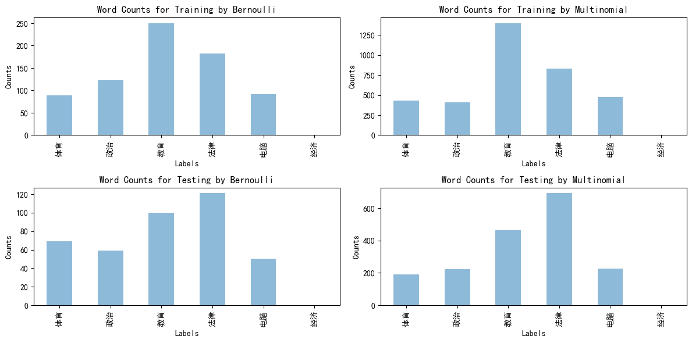

# 第3次作业 贝叶斯分类器

## 数据下载与解压
首先是从给定网站上下载数据集并解压，通过以下程序实现。

```python
import requests
import zipfile

def download_dataset(url, filename):
    data = requests.get(url)
    with open(filename, 'wb') as code:
        code.write(data.content)
    print(f"Downloading the datasets {filename} complete.")
    data_file = zipfile.ZipFile(filename, 'r')
    data_list = data_file.namelist()

    for file in data_list:
        data_file.extract(file, 'd:/Desktop/AI-ML-methods/homework/assignment3/')
    data_file.close()
    print(f"Unzipping the datasets {filename} complete.")

url = 'http://www.nustm.cn/member/rxia/ml/data/Tsinghua.zip'
download_dataset(url, 'Tsinghua.zip')
```

## 文本数据处理
对数据文件夹```Tsinghua```进行预处理，读入停词文件```Tsinghua/stop_words_zh.txt```，将读入numpy的训练集和测试集文件按照多项分布贝叶斯和多项伯努利分布贝叶斯的要求（TF权重和BOOL权重）进行词频统计。

```python
import os
import numpy as np
import matplotlib.pyplot as plt
from collections import defaultdict

# 停词处理
def segment_text(text, stopwords):
    for j in range(text.shape[0]):
        for word in stopwords:
            if word in text[j]:
                text[j] = text[j].replace(word, '')
    # print(f"info of text: {type(text)}, {text.shape}, 
    #       info of stopwords: {type(stopwords)}, {len(stopwords)}")
    return text

# 加载停用词列表
def load_stopwords(stopwords_file):
    with open(stopwords_file, 'r', encoding='utf-8') as f:
        stopwords = [line.strip() for line in f]
    return set(stopwords)

# 加载数据集
label_mapping = defaultdict(int) # label mapping dictionary

def load_data(data_dir, stopwords_file):
    X = []
    X_total = []
    y = []

    # Mapping to convert labels to integers
    stopwords = load_stopwords(stopwords_file)
    categories = os.listdir(data_dir)
    global label_mapping

    for i, category in enumerate(categories):
        # 获取文件名作为label, label不在字典 label_mapping 中时，将其添加字典中
        label = os.path.splitext(category)[0]     
        if label not in label_mapping:
            label_mapping[label] = len(label_mapping)
        
        file_path = os.path.join(data_dir, category)
        with open(file_path, 'r', encoding='utf-8') as file:
            # 读取文件中的每一行，并将其存储为 NumPy 数组
            text = np.array(file.read().splitlines())
        # 移除停用词
        text = segment_text(text, stopwords)

        _b1 = text != '<text>' 
        _b2 = text != '</text>'
        # text 数组的对应元素同时满足 _b1 和 _b2 的条件
        _b = np.all(np.c_[_b1, _b2], axis=1)
        # print(f"info of skiping </text>: {type(_b)}, {_b.shape}")
        text = text[_b]
        # print(text) # 经过处理后的文本 numpy数组

        for sentence in text:
            # 一个句子 sentence 按照空格进行分割，
            words = sentence.split()
            X_total += words
            X.append(words)
            # y.append(label_mapping[label])
        y += [label_mapping[label]] * len(text)
        # print(len(X), len(y), len(X_total))
    return X, y


path_to_train_data = '../Tsinghua/train/'
path_to_test_data = '../Tsinghua/test/'
stopwords_file = '../Tsinghua/stop_words_zh.txt'

X_train, y_train = load_data(path_to_train_data, stopwords_file)
X_test, y_test = load_data(path_to_test_data, stopwords_file)

# print(type(X_train), len(X_train)) # <class 'list'> 1195
# print(type(y_train), len(y_train)) # <class 'list'> 1195
# print(len(X_test)) # 754
# print(len(y_test)) # 754

def create_word_vector(X, label_mapping, method):
    assert method in ['bernulli', 'multinomial'], 'Method must be either "bernulli" or "multinomial"'
    
    # Shape of word_matrix: (number of sentences, number of labels)
    word_matrix = np.zeros((len(X), len(label_mapping)))
    for i, sentence in enumerate(X):
        for word in sentence:
            if word in label_mapping.keys():
                if method == 'bernulli':
                    word_matrix[i, label_mapping[word]] = 1 
                elif method == 'multinomial':
                    word_matrix[i, label_mapping[word]] += 1
    return word_matrix

word_matrix_tb = create_word_vector(X_train, label_mapping, 'bernulli')
word_matrix_tm = create_word_vector(X_train, label_mapping, 'multinomial')
word_matrix_pb = create_word_vector(X_test, label_mapping, 'bernulli')
word_matrix_pm = create_word_vector(X_test, label_mapping, 'multinomial')
```

```python
import numpy as np
import pandas as pd 
import matplotlib.pyplot as plt

def visualize_data(word_matrix, label_mapping, title, fig):

    plt.rcParams['font.family'] = 'SimHei' # 解决不能输出中文的问题。不区分大小写，中括号可以不要
    plt.rcParams['figure.autolayout'] = True # 解决不能完整显示的问题（比如因为饼图太大，显示窗口太小）
    
    labels = list(label_mapping.keys())
    counts = np.sum(word_matrix, axis=0)
    data = pd.Series(counts, index=labels)

    data.plot.bar(ax=fig, alpha=0.5)
    fig.set_xlabel('Labels')
    fig.set_ylabel('Counts')
    fig.set_title(f'Word Counts for {title}')

fig, ax = plt.subplots(2, 2, figsize=(12, 6))
visualize_data(word_matrix_tb, label_mapping, 'Training by Bernoulli', fig=ax[0][0])
visualize_data(word_matrix_tm, label_mapping, 'Training by Multinomial', fig=ax[0][1])
visualize_data(word_matrix_pb, label_mapping, 'Testing by Bernoulli', fig=ax[1][0])
visualize_data(word_matrix_pm, label_mapping, 'Testing by Multinomial', fig=ax[1][1])
```

可视化结果如下：



## 两种贝叶斯分类器
下面是我们编写的多项分布和多次伯努利分布贝叶斯分类器，其位于文件```src/naive_bayes.py```。

```python
# naive_bayes.py
import numpy as np

class MultinomialNBC(object):
    def __init__(self):
        self.class_prior_ = None # (n_classes,)
        self.ftr_log_prob_ = None 
        self.classes = None # (n_classes,)
        self.ftr_counts = None # (n_classes, n_features)
        self.n_classes = None 

    def fit(self, X_counts, y):
        self.classes = np.unique(y) # get unique classes
        self.n_classes = len(self.classes) # num of classes

        self.class_counts = np.zeros(self.n_classes)
        self.ftr_counts = np.zeros((self.n_classes, X_counts.shape[1]))

        for i, cls_ in enumerate(self.classes):
            cls_indices = np.where(y == cls_)[0] # get indices of class cls_
            self.class_counts[i] = len(cls_indices)
            self.ftr_counts[i] = np.array(X_counts[cls_indices].sum(axis=0)).flatten()

        # calculate class priors and feature log probabiltes 
        self.class_prior_ = self.class_counts / np.sum(self.class_counts)
        self.ftr_log_prob_ =  np.log(self.ftr_counts + 1) - \
            np.log((np.sum(self.ftr_counts, axis=1, keepdims=True) + self.n_classes))

    def predict(self, X_counts):
        # calculate log likelihoods for each class
        log_likelihoods = np.dot(X_counts, self.ftr_log_prob_.T) + np.log(self.class_prior_)
        # predict the class with the highest log likelihood
        return self.classes[np.argmax(log_likelihoods, axis=1)]

class BernulliNBC(object):
    def __init__(self):
        self.class_prior_ = None # (n_classes,)
        self.ftr_log_prob_ = None 
        self.classes = None # (n_classes,)
        self.ftr_counts = None # (n_classes, n_features)
        self.n_classes = None 

    def fit(self, X_bin, y):
        self.classes = np.unique(y) # get unique classes
        self.n_classes = len(self.classes) # num of classes

        self.class_counts = np.zeros(self.n_classes)
        self.ftr_counts = np.zeros((self.n_classes, X_bin.shape[1]))

        for i, cls_ in enumerate(self.classes):
            cls_indices = np.where(y == cls_)[0] # get indices of class cls_
            self.class_counts[i] = len(cls_indices)
            self.ftr_counts[i] = np.array(X_bin[cls_indices].sum(axis=0)).flatten()
        # calculate class priors and feature log probabiltes
        self.class_prior_ = self.class_counts / np.sum(self.class_counts)
        self.ftr_log_prob_ =  np.log(self.ftr_counts + 1) - \
            np.log((np.sum(self.ftr_counts, axis=1, keepdims=True) + 2))

    def predict(self, X_bin):
        log_likelihoods = np.dot(X_bin, self.ftr_log_prob_.T) + np.log(self.class_prior_)
        return self.classes[np.argmax(log_likelihoods, axis=1)]
```

## 贝叶斯分类器和SVM 分类器的比较

### sklearn 实现贝叶斯分类器
我们可以使用 sklearn.naive_bayes库调用多项分布贝叶斯和多次伯努利分布贝叶斯分类器。

```python
from sklearn.naive_bayes import MultinomialNB
from sklearn.naive_bayes import BernoulliNB
from sklearn.metrics import confusion_matrix
from sklearn.metrics import accuracy_score

classifier = MultinomialNB()
classifier.fit(word_matrix_tm, y_train)
 
# predicting test set results
y_pred = classifier.predict(word_matrix_pm)
 
# making the confusion matrix
cm = confusion_matrix(y_test, y_pred)
print(cm)
accuracy_score(y_test, y_pred)
```

### 贝叶斯分类器结果

下面是调用我们编写的多项分布贝叶斯分类器和多次伯努利分布分类器的分类结果。

```python
classifier1 = MultinomialNBC()
classifier1.fit(word_matrix_tm, y_train)
results = classifier1.predict(word_matrix_pm)
acc = np.mean(results == y_test)
print(f"accuracy for Multinomial NB Classifier: {acc}")
```

```accuracy for Multinomial NB Classifier: 0.6114058355437666```

```python

classifier2 = BernulliNBC()
classifier2.fit(word_matrix_tb, y_train)
results = classifier2.predict(word_matrix_pb)
acc = np.mean(results == y_test)
print(f"accuracy for Bernonulli NB Classifier: {acc}")
```

```accuracy for Bernonulli NB Classifier: 0.5994694960212201```

### SVM 分类器和结果对比
下面是分别使用 TF权重的SVM分类器和 BOOL权重的SVM 分类器两种分类结果以及 同两种朴素贝叶斯分类器的分类结果对比表格。

```python
from sklearn.svm import SVC

svm_multi = SVC()
svm_bernu = SVC()
svm_multi.fit(word_matrix_tm, y_train)
svm_bernu.fit(word_matrix_tb, y_train)

svm_multi.score(word_matrix_pm, y_test)
svm_bernu.score(word_matrix_pb, y_test)
```

分类结果```Results: 0.5954907161803713, 0.6180371352785146```

Results for tabular 

| ------------- | Naive Bayes Classifier | Support Vector Machine |
| ------------- | ------------------- | ------------------------- |
| Multinomial| Mutinomial NB: 61.14% | SVM by TF weights: 59.55% |
| Bernonulli | Bernonulli NB: 59.95% | SVM by BOOL weights: 61.80% |

