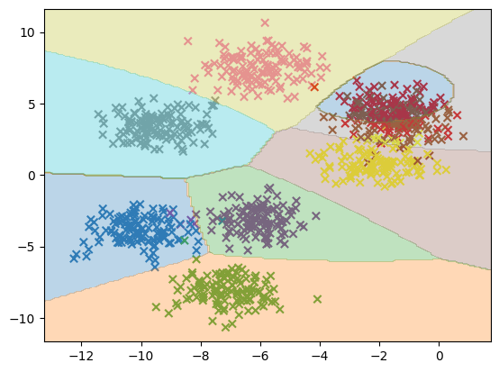

# Assignment-4: Clustering

[TOC]

## 文件结构 

我们可以直接运行 ```src/```中的文件，实现对```gmm```中数据进行 k_means 聚类和 GMM 聚类 以及 高斯朴素贝叶斯分类。

```bash
.
├── README.md
├── assignment4.md
├── figs
│   ├── data-gmm3.png
│   ├── data-gmm4.png
│   ├── data-gmm6.png
│   ├── data-gmm8.png
│   ├── gmm-6.png
│   ├── gmm-8.png
│   ├── gnb-res6.png
│   ├── gnb-res8.png
│   ├── kMeans-6.png
│   └── kMeans-8.png
├── gmm
│   ├── GMM3.txt
│   ├── GMM4.txt
│   ├── GMM6.txt
│   └── GMM8.txt
├── scripts
│   ├── bayes.ipynb
│   └── cluster.ipynb
└── src
    ├── gmm.py
    ├── k_means.py
    └── naive_bayes.py
```

## 数据集准备

下载并解压数据集， 

```python
import requests
import zipfile

def download_dataset(url, filename):
    data = requests.get(url)
    with open(filename, 'wb') as code:
        code.write(data.content)
    print(f"Downloading the datasets {filename} complete.")
    data_file = zipfile.ZipFile(filename, 'r')
    data_list = data_file.namelist()

    for file in data_list:
        data_file.extract(file, 'd:/Desktop/AI-ML-methods/homework/assignment4/')
    data_file.close()
    print(f"Unzipping the datasets {filename} complete.")

url = 'http://www.nustm.cn/member/rxia/ml/data/gmm.zip'
download_dataset(url, 'gmm.zip')
```

导入数据集并进行可视化的结果

```python
import os
import numpy as np
import matplotlib.pyplot as plt

def load_file_data(file_path):
    X = []
    y = []
    text = np.loadtxt(file_path, skiprows=1)
    X.append(text[:, 1:])
    y.append(text[:, 0])
    return np.concatenate(X, axis=0), np.concatenate(y, axis=0)

file_path = 'd:/Desktop/AI-ML-methods/homework/assignment4/gmm/GMM6.txt'
X, y = load_file_data(file_path)

print(X.shape, y.shape)
n_classes = int(np.max(np.unique(y))) + 1
plt.scatter(X[:, 0], X[:, 1], c=y, \
            marker='o', s=5, cmap=plt.cm.get_cmap('Set1', n_classes))
plt.colorbar()
plt.show()
```

将```gmm```中四个分类数据集分别进行可视化的结果

<table>
    <tr>
        <td ><center>fig1: gmm3 </center></td>
        <td ><center>fig2: gmm4 </center></td>
    </tr>
    <tr>
        <td><center>fig3: gmm6 </center></td>
        <td ><center>fig4: gmm8 </center> </td>
    </tr>
</table>

## Gussian Naive Bayes Classifier

代码见 ```src/navie_bayes.py```。

```python 
from sklearn.model_selection import KFold
from sklearn.model_selection import cross_val_score

# 初始化交叉验证分割器和分类器模型
kf = KFold(n_splits=5, shuffle=True, random_state=42)
classifier = GaussianNBC()

# 用于存储每个交叉验证模型的评分
cv_scores = []

# 执行 N 倍交叉验证
for train_index, test_index in kf.split(X):
    X_train, X_test = X[train_index], X[test_index]
    y_train, y_test = y[train_index], y[test_index]

    classifier.fit(X_train, y_train)
    y_pred = classifier.predict(X_test)
    score = np.mean(y_pred == y_test)
    cv_scores.append(score)

# 输出每个交叉验证模型的评分
for i, score in enumerate(cv_scores):
    print("Fold {}: {}".format(i+1, score))

# 输出交叉验证评分的平均值
print("Average CV Score:", np.mean(cv_scores))
```

在数据集 ```gmm/GMM6.txt```上进行交叉验证的结果:

```bash
Fold 1: 0.945
Fold 2: 0.945
Fold 3: 0.965
Fold 4: 0.96
Fold 5: 0.97
Average CV Score: 0.9570000000000001
```

Visualization Code:

```python
import matplotlib.pyplot as plt

def visualization(classifier, X, y):
    plt.figure()
    # X.shape: (N, D), W.shape: (D, C), y.shape: (N, 1)
    n_classes = int(np.max(np.unique(y))) + 1
    plt.scatter(X[:, 0], X[:, 1], c=y, marker='x',cmap=plt.cm.get_cmap('Set1', n_classes))

    # Generate a grid of points for visualization
    x_min, x_max = X[:, 0].min() - 1, X[:, 0].max() + 1
    y_min, y_max = X[:, 1].min() - 1, X[:, 1].max() + 1
    xx, yy = np.meshgrid(np.arange(x_min, x_max, 0.1),
                         np.arange(y_min, y_max, 0.1))
    flat_X = np.concatenate([xx.ravel().reshape(-1, 1), yy.ravel().reshape(-1, 1)], axis=1)
    # print(inp.shape)  # (num of pixels, 2)
    flat_y = classifier.predict(flat_X)
    flat_y = flat_y.reshape(xx.shape)
    # Plot decision boundary
    plt.contourf(xx, yy, flat_y, alpha=0.3, cmap=plt.cm.get_cmap('gray', n_classes))
    plt.show()

visualization(classifier, X, y)

```

Guassian naive bayes classifier 分类结果可视化

<table>
    <tr>
        <td ><center>fig1: gmm6 GNB-res </center></td>
        <td ><center>fig2: gmm8 GNB-res </center></td>
    </tr>
</table>

## K-means Clustering:

code can be seen on ```src/k_means.py```

kMeans 聚类中心初始化及最终结果显示代码： 

```python
# k_means.py
import numpy as np

"""
包含 k 个随机质心的集合。随机质心在整个数据集的边界之内，可以通过找到数据集每一维的最小和最大值,
生成 0~1.0 之间的随机数并通过取值范围和最小值，以便确保随机点在数据的边界之内。
"""
def randCent(dataSet, k):
    n = dataSet.shape[1]         # 列的数量，即数据的特征个数
    centroids = np.zeros((k, n)) # 创建k个质心矩阵
    for j in range(n):           # 创建随机簇质心，并且在每一维的边界内
        minJ = np.min(dataSet[:, j])     # 最小值
        rangeJ = float(np.max(dataSet[:, j]) - minJ)    # 范围 = 最大值 - 最小值
        centroids[:, j] = minJ + rangeJ * np.random.rand(k)  
    return centroids

# display final results for clustering
def kMeans_display(centroids, clusters, wcss_history, K=6):
    fig, ax = plt.subplots(1, 2, figsize=(12, 4))
    ax[0].plot(wcss_history, '.--')
    ax[0].set_title('Final WCSS')

    ax[1].scatter(X[:, 0], X[:, 1], c=clusters[:, 0], \
                  marker='o', s=5, cmap=plt.cm.get_cmap('Set1', K))
    ax[1].scatter(centroids[:, 0], centroids[:, 1], c=np.arange(K), \
                  marker='x', s=200, linewidths=3, cmap=plt.cm.get_cmap('Set1', K))
    ax[1].set_title('Final Iteration')
```

kMeans 核心代码：

```python
def kMeans(X, K, max_iters=100, if_display=True):
    n_samples, n_features = X.shape
    clusters = np.zeros((n_samples, n_features))  # 保存每个数据点的簇分配结果和平方误差
    centroids = randCent(X, K)
    cluster_changed = True
    iter = 0
    wcss_history = []

    plt.ion()
    if if_display: # if display iteration procession
        fig, ax = plt.subplots(1, 2, figsize=(12, 4))
    while cluster_changed and iter < max_iters:
        cluster_changed = False
        for i in range(n_samples):
            min_dist = np.inf
            min_index = -1
            for j in range(K):
                dist = np.sum((X[i] - centroids[j]) ** 2)
                if dist < min_dist:
                    min_dist = dist
                    min_index = j
                if clusters[i, 0] != min_index:
                    cluster_changed = True
            clusters[i, :] = min_index, min_dist
        
        wcss = np.sum(min_dist)
        wcss_history.append(wcss)
        # print(centroids)

        for cent in range(K): # Updata centroids
            Inclusters = X[np.nonzero(clusters[:, 0] == cent)[0]]
            centroids[cent, :] = np.mean(Inclusters, axis=0)   
        iter += 1
        
        if if_display: # if display iteration procession          
            ax[0].cla()
            ax[0].plot(wcss_history, '.-')
            ax[0].set_title(f'WCSS: {wcss:.4f}')

            ax[1].cla()
            ax[1].scatter(X[:, 0], X[:, 1], c=clusters[:, 0], \
                        marker='o', s=5, cmap=plt.cm.get_cmap('Set1', K))
            ax[1].scatter(centroids[:, 0], centroids[:, 1], c=np.arange(K), \
                        marker='x', s=200, linewidths=3, cmap=plt.cm.get_cmap('Set1', K))
            ax[1].set_title(f'Iteration {iter}')

            plt.pause(0.2)  # 暂停一段时间以便动态显示
    
    kMeans_display(centroids, clusters, wcss_history, K=K)
    plt.ioff()
    plt.show()
    
    return centroids, clusters, wcss_history

centroids, clusters, _ = kMeans(X, K=6, max_iters=50, if_display=False)
print(centroids.shape, clusters.shape)
print(centroids)
```

Ouput results on ```gmm/GMM6.txt```:

```bash
(6, 2) (1000, 2)
[[-1.86806185 -9.26505943]
 [ 0.82976492 -1.5477169 ]
 [-0.62132333 -9.78548695]
 [-5.85378895  2.35530855]
 [-2.96626581 -4.24113416]
 [ 2.60886397  0.64110024]]
```

Visualization Results:

<table>
    <tr>
        <td ><center>fig1: gmm6 Kmeans-res </center></td>
    </tr>
    <tr>
        <td ><center>fig2: gmm8 Kmeans-res </center></td>
    </tr>
</table>

## GMM Clustering

Code can be seen on ```src/gmm.py```, in which we have implemented a **gmm model from sketch**

Code Pipeline as following:

```python
from sklearn.mixture import GaussianMixture
K = n_classes
gmm = GaussianMixture(n_components=K, max_iter=50, random_state=0)
gmm.fit(X)

# Assign a label to each sample
labels = gmm.predict(X)
plt.figure()
plt.scatter(X[:, 0], X[:, 1], c=labels, \
            s=5, cmap=plt.cm.get_cmap('Set1', K))
plt.title('GMM Clustering')

# print the converged log-likelihood value and  the number of iterations needed
print(f"the converged log-likelihood: {gmm.lower_bound_}, iternations: {gmm.n_iter_}")
```

visualization results of GMM methods:

<table>
    <tr>
        <td ><center>fig1: gmm6 GMM-res </center></td>
    </tr>
    <tr>
        <td ><center>fig2: gmm8 GMM-res </center></td>
    </tr>
</table>


