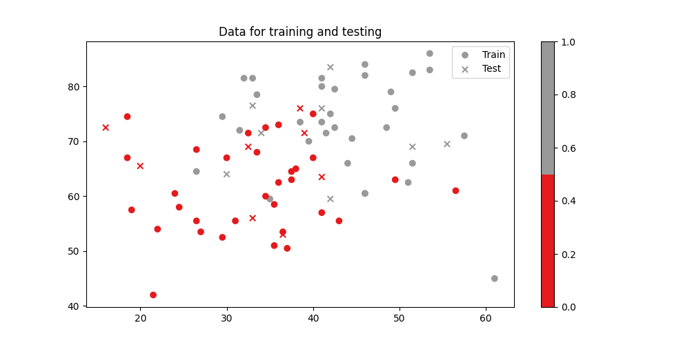
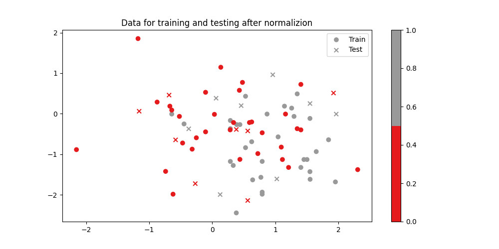
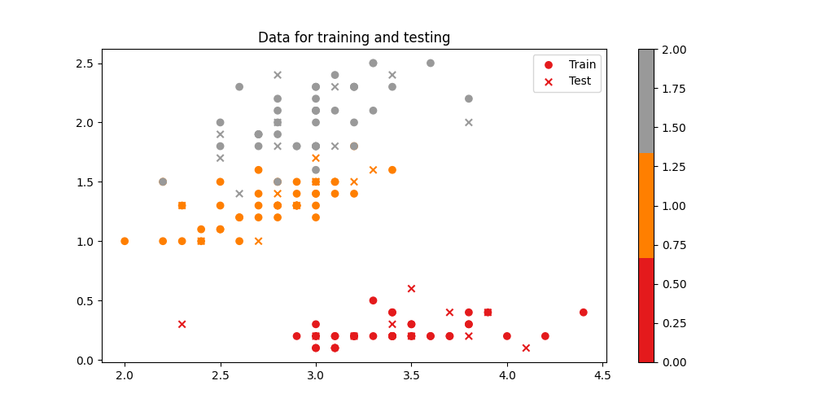
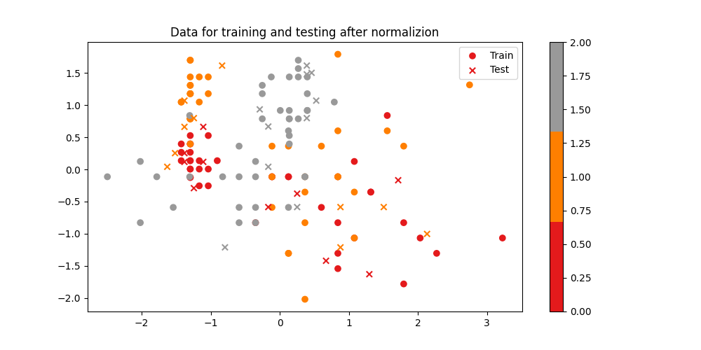
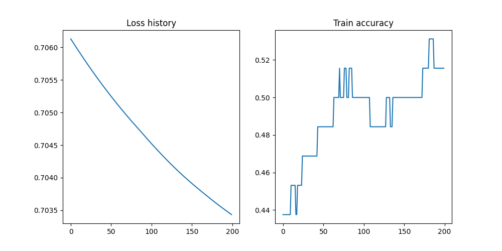
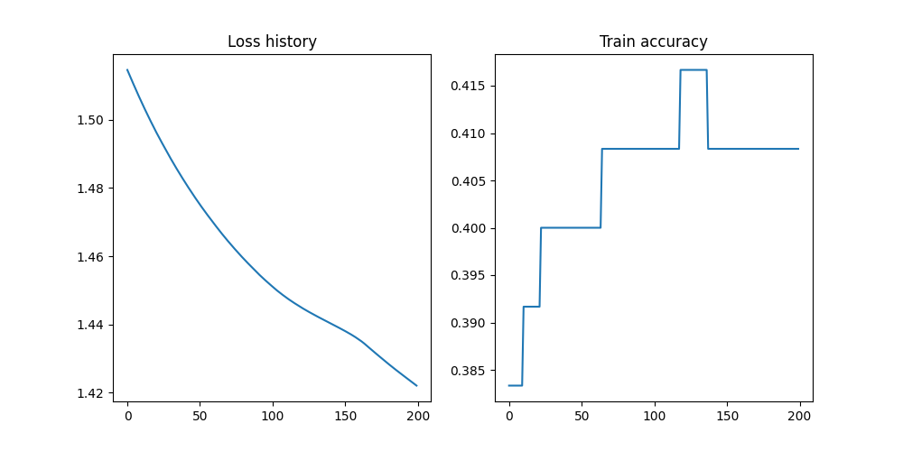
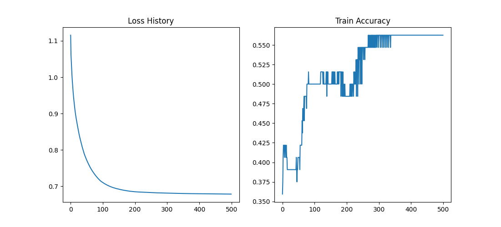
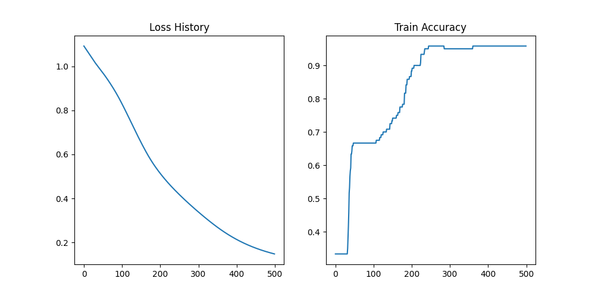

# Assignment-5: Forward Neural Network

**ID： 2023E8014682040， 邓勇， 自动化研究所**

## 1. numpy 实现 

使用 Exam 和 Iris 数据集， 下面是原数据和归一化后的数据
<table>
    <tr>
        <td ><center> fig1: Original Exam dataset </center></td>
        <td ><center> fig2: Exam after normalization </center></td>
    </tr>
    <tr>
        <td ><center> fig1: Original Iris dataset </center></td>
        <td ><center> fig2: Iris after normalization </center></td>
    </tr>
</table>

为了从零实现一个前向神经网络，我们定义了一个神经网络类 ```NeuralNet(object)```, 其中包括 ```__init__```, ```forward```, ```backward```, ```fit```, ```predict``` 等函数， 具体代码见文件```src/net_pytorch.py```

不使用 weight_decay 和 dropout 这两种正则化技术， 使用早停方法防止过拟合，设置 patience=10， 我们使用 归一化后的 Exam 两分类数据集和 Iris 多分类数据集进行训练和测试，结果如下：

<table>
<tr>
    <td ><center> fig4: Training record on Exam dataset </center></td>
<tr> 
    <td ><center> fig3: Training record on Iris dataset </center></td>
</tr>
</table>

Iris 数据集控制台输出结果如下： 

```bash
Epoch 0/200, loss: 2.581223238855882
Epoch 20/200, loss: 2.198730369652786
Epoch 40/200, loss: 2.015714255197691
Epoch 60/200, loss: 1.9126634867120151
Epoch 80/200, loss: 1.8366087783726681
Epoch 100/200, loss: 1.7590726065007962
Epoch 120/200, loss: 1.67112127932693
Epoch 140/200, loss: 1.5535105563751428
Finished training, best loss: 1.346641257837235
Test accuracy: 0.43333333333333335
[2 2 0 2 0 2 0 2 2 2 2 2 0 2 0 2 2 2 0 2 2 2 2 2 2 2 2 2 2 2]
```


## 2. pytorch 实现

具体代码可以见于文件 ```src/net_pytorch.py```
定义网络结构的代码如下：

```python  
import torch
import torch.nn as nn
import torch.nn.functional as F
import numpy as np
import matplotlib.pyplot as plt
from torch.utils.data import DataLoader

class NeualNet(nn.Module):
    """A simple neural network."""
    def __init__(self, input_size, hidden_size, output_size):
        super(NeualNet, self).__init__()
        self.fc1 = nn.Linear(input_size, hidden_size)
        self.fc2 = nn.Linear(hidden_size, hidden_size)
        self.fc3 = nn.Linear(hidden_size, output_size)
        
    def forward(self, x):
        x = F.relu(self.fc1(x))
        x = F.relu(self.fc2(x))
        x = self.fc3(x)
        # x = F.softmax(x, dim=1)
        return x
```

训练和测试的代码如下：

```python 
X_train = np.loadtxt('../Iris/train/x.txt')
y_train = np.loadtxt('../Iris/train/y.txt')
X_test = np.loadtxt('../Iris/test/x.txt')
y_test = np.loadtxt('../Iris/test/y.txt')

n_samples, input_size = X_train.shape
hidden_size = 10
output_size = int(np.max(y_train)) + 1
n_epochs = 200
learning_rate = 0.001
batch_size = 40

X_train = torch.from_numpy(X_train).float()
y_train = torch.from_numpy(y_train).long()
X_test = torch.from_numpy(X_test).float()

print(X_train.shape, y_train.shape)
# device config
device = torch.device("cuda" if torch.cuda.is_available() else "cpu")

model = NeualNet(input_size, hidden_size, output_size)
criterion = nn.CrossEntropyLoss()
optimizer = torch.optim.Adam(model.parameters(), lr=0.001)
for i in range(n_epochs):
    X_train = X_train.reshape(-1, input_size).to(device)
    y_train = y_train.to(device)
    # forward pass
    outputs = model(X_train)
    loss = criterion(outputs, y_train)

    # backward and optimize
    optimizer.zero_grad()
    loss.backward()
    optimizer.step()

    if (i+1) % 10 == 0:
        print(f'Epoch [{i+1}/{n_epochs}], Loss: {loss.item():.4f}')
        
print('Finished Training')

# Test the model
with torch.no_grad():
    X_test = X_test.to(device)
    y_pred = model(X_test)
    _, y_pred = torch.max(y_pred, 1)
    y_pred = y_pred.cpu().numpy()
    acc = np.mean(y_pred == y_test)
    # print(f'Predicted: {y_pred}')
    print(f'Accuracy: {acc:.4f}')
```

使用 Pytorch 构建的前向神经网络，分别训练和测试 Exam 和 Iris 数据集，结果如下：

<table>
    <tr>
        <td ><center> fig4: Pytorch results on Exam dataset </center></td>
    </tr>
    <tr>
        <td ><center> fig5: Pytorch results on Iris dataset </center></td>
    </tr>
</table>