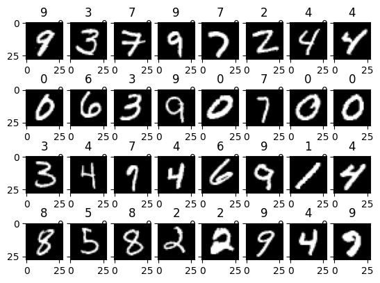
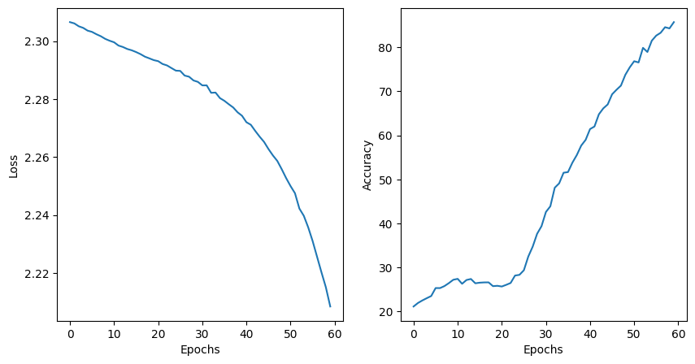

# Assignment-6: CNN  

**ID: 2023E8014682040, 邓勇， 自动化研究所**

## Modules of CNN  

下面是关于卷积神经网络的相关内容：

+ Convolutional Layer
  + input size: $(n_h \times n_w)$, convo kernel: $(k_h \times k_w)$, 
  + padding: $(p_h, p_w)$,  stride: $(s_h, s_w)$
  + output size: $$(n_h - k_h + p_h + 1)\times (n_w - k_w + p_w + 1)$$
  + output size: $$\lfloor(n_h - k_h + p_h + s_h)/s_h \rfloor \times \lfloor (n_w - k_w + p_w + s_w)/s_w \rfloor$$ , or we can just compute $$ \lfloor (N - K + P) / S \rfloor + 1$$ if $p_h = k_h -1, p_w = k_w - 1$, output $(n_h/s_h)\times (n_w/s_w)$
+ Max Pooling  
  + (2 x 2) max pooling, output size: $(n_h/2)\times (n_w/2)$
+ Pytorch code
  + ```torch.nn.Conv2d```: 卷积层
  + ```torch.nn.MaxPool2d```: 最大池化层
  + ```torch.nn.Flatten```: 展平层
  + ```torch.nn.Linear```: 全连接层

  + ```torch.nn.Sequential```: 顺序模型
+ utils 
  + ```out = torchvision.utils.make_grid(images)``` : 显示图像
  + ```imshow(out, title=[class_names[x] for x in classes])```: 显示图像
  + ```torchvision.transforms.ToPILImage()```: 图像转换


Designed convolutional layer as following:

```python  
class ConvNetwork(nn.Module):
    # original shape of images [bz, 3, 28, 28]
    # input_layer: 3 input channels, 6 output channels, 5 kernel size 
    def __init__(self):
        super(ConvNetwork, self).__init__() 
        self.conv1 = nn.Conv2d(1, 6, 5) # [bz, 3, 28, 28] -> [bz, 6, 24, 24]
        self.pool = nn.MaxPool2d(2, 2)  # [bz, 6, 24, 24] -> [bz, 6, 12, 12]
        self.conv2 = nn.Conv2d(6, 16, 3)# [bz, 6, 12, 12] -> [bz, 16, 10, 10] 
        # pool: [bz, 16, 10, 10] -> [bz, 16, 5, 5]
        self.fc1 = nn.Linear(16 * 5 * 5, 120) # [bz, 16, 5, 5] -> [bz, 120]
        self.fc2 = nn.Linear(120, 84) # [bz, 120] -> [bz, 84]
        self.fc3 = nn.Linear(84, 10) # [bz, 84] -> [bz, 10]

    def forward(self, x):
        x = F.relu(self.conv1(x))
        x = self.pool(x)
        x = F.relu(self.conv2(x))
        x = self.pool(x)
        # flatten the output of conv2 to (batch_size, 16*5*5)
        x = x.view(-1, 16 * 5 * 5)
        x = F.relu(self.fc1(x))
        x = F.relu(self.fc2(x))
        return self.fc3(x)
```

## Training and Testing using Pytorch

```python
writer = SummaryWriter("runs/mnist")

# device config
device = torch.device('cuda' if torch.cuda.is_available() else 'cpu')

# Hyperparameters 
input_size = 784 # 28x28
hidden_size = 50
num_classes = 10
num_epochs = 5
batch_size = 32
learning_rate = 0.001

# MNIST dataset
transform = transforms.Compose(
    [transforms.ToTensor(), 
     transforms.Normalize((0.5, ), (0.5, ))]
)
 
train_dataset = datasets.MNIST(root='./data', train=True, transform=transform, download=True) 
test_dataset = datasets.MNIST(root='./data', train=False, transform=transform, download=True)
train_loader = DataLoader(dataset=train_dataset, batch_size=batch_size, shuffle=True)
test_loader = DataLoader(dataset=test_dataset, batch_size=batch_size, shuffle=False) 

examples = iter(train_loader) 
images, labels = examples.__next__()
print(f'Size of data, labels: {images.shape}, {labels.shape}')

img_grid = torchvision.utils.make_grid(images)
writer.add_image('MNIST Images', img_grid)
```

我们可以看到它读入图片和标签：

<table>
<tr>
  <td><center> fig1: Batch data of MNIST </center> </td>
</tr>
</table>

接下来我们训练和测试该模型：

```python
model = ConvNetwork()
# loss and optimizer 
criterion = nn.CrossEntropyLoss() 
optimizer = torch.optim.SGD(model.parameters(), lr=learning_rate) 

# training loop 
n_total_steps = len(train_loader)
running_loss = 0.0 
running_correct = 0 

for epoch in range(num_epochs):
    for i, (images, labels) in enumerate(train_loader):
        images = images.to(device) 
        labels = labels.to(device)

        # forward pass 
        outputs = model(images) 
        loss = criterion(outputs, labels) 
        # backward pass and update weights 
        optimizer.zero_grad()
        loss.backward()
        optimizer.step()

        # tensorbard 
        running_loss += loss.item() 
        _, predicted = torch.max(outputs.data, 1)
        running_correct += (predicted == labels).sum().item()

        if (i+1) % 100 == 0:
            print(f'epoch {epoch+1}/{num_epochs}, step {i+1}/{len(train_loader)}, loss = {running_loss/100:.3f}')
            writer.add_scalar('training loss', running_loss/100, epoch*n_total_steps + 1)
            writer.add_scalar('accuracy', running_correct/100, epoch*n_total_steps + 1)
            running_loss = 0.0
            running_correct = 0 

# Test 
preds = [] 
pred_labels = []

with torch.no_grad():
    n_correct = 0
    n_samples = 0
    for images, labels in test_loader:
        images = images.to(device) 
        labels = labels.to(device) 
        outputs = model(images) 

        # max returns (value, index) 
        _, predicted = torch.max(outputs.data, 1) 
        n_samples += labels.shape[0] 
        n_correct += (predicted == labels).sum().item() 

        # classification results for tensorboard 
        class_predictions = [F.softmax(output, dim=0) for output in outputs]
        # print(predicted, labels)
        preds.append(class_predictions) 
        pred_labels.append(predicted) 

    preds = torch.cat([torch.stack(batch) for batch in preds])
    pred_labels = torch.cat(pred_labels, dim=0) 
    acc = 100.0 * n_correct / n_samples 
    print(f'Accuracy on the testing images = {acc}%')

    for i in range(num_classes):
        labels_i = pred_labels == i
        preds_i = preds[:, i]
        writer.add_pr_curve(str(i), labels_i, preds_i, global_step=0) 
        
    writer.close()
```

## Pytorch Lightning Implementation 

PyTorch Lightning 是一个用于深度学习项目的轻量级开发框架，它构建在 PyTorch 之上，提供了更高级别的抽象。 PyTorch Lightning 的设计理念是尽可能地减少样板代码，让用户专注于模型的设计和调试，同时提供了丰富的功能和扩展接口，使得用户可以根据自己的需求定制训练过程。下面通过 Pytorch Lightning 实现一个简单的 CNN 模型。

```python 
import torch
import torch.nn as nn
import torch.nn.functional as F
import pytorch_lightning as pl 
from torchvision import transforms, datasets
from torch.utils.data import DataLoader, Dataset 

transform = transforms.Compose(
    [transforms.ToTensor(),
     transforms.Normalize((0.5, ), (0.5, ))]
)

# Hyperparameters 

num_epochs = 5 
batch_size = 100 
learning_rate = 0.001

class LitCNN(pl.LightningModule):
    # original shape of images [bz, 1, 28, 28]
    # input_layer: 3 input channels, 6 output channels, 5 kernel size 
    def __init__(self):
        super(LitCNN, self).__init__() 
        self.conv1 = nn.Conv2d(1, 6, 5) # [bz,1, 28, 28] -> [bz, 6, 24, 24]
        self.pool = nn.MaxPool2d(2, 2)  # [bz, 6, 24, 24] -> [bz, 6, 12, 12]
        self.conv2 = nn.Conv2d(6, 16, 3)# [bz, 6, 12, 12] -> [bz, 16, 10, 10] 
        # pool: [bz, 16, 10, 10] -> [bz, 16, 5, 5]
        self.fc1 = nn.Linear(16 * 5 * 5, 120) # [bz, 16, 5, 5] -> [bz, 120]
        self.fc2 = nn.Linear(120, 84) # [bz, 120] -> [bz, 84]
        self.fc3 = nn.Linear(84, 10) # [bz, 84] -> [bz, 10]

    def forward(self, x):
        x = F.relu(self.conv1(x))
        x = self.pool(x)
        x = F.relu(self.conv2(x))
        x = self.pool(x)
        # flatten the output of conv2 to (batch_size, 16*5*5)
        x = x.view(-1, 16 * 5 * 5)
        x = F.relu(self.fc1(x))
        x = F.relu(self.fc2(x))
        return self.fc3(x)
    
    def configure_optimizers(self):
        return torch.optim.SGD(self.parameters(), lr=learning_rate)
    
    def training_step(self, batch, batch_idx):
        images, labels = batch  

        outputs = self(images) 
        loss = F.cross_entropy(outputs, labels)
        tensorboard_logs = {'train_loss': loss}
        return {'loss': loss, 'log': tensorboard_logs}
    
    def train_dataloader(self):
        train_dataset = datasets.MNIST(root='./data', train=True, transform=transform, download=True)
        train_loader = DataLoader(dataset=train_dataset, batch_size=batch_size, shuffle=True)
        return train_loader


model = LitCNN() 
trainer = pl.Trainer(max_epochs=num_epochs, fast_dev_run=False) 
trainer.fit(model)
```

## Results

训练超参数：  ```num_epochs=20, batchsize=200```
CNN 训练结果

<td><center>fig2: CNN training loss and accuracy</center></td>

CNN 测试结果：
```Accuracy on the testing images = 43.94%```  
